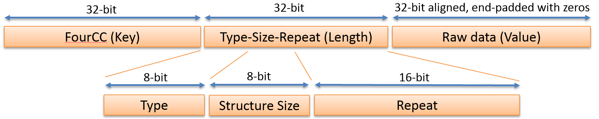
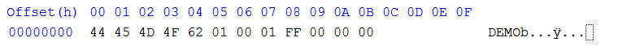
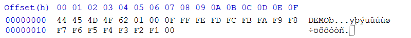
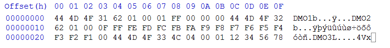
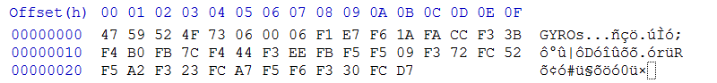
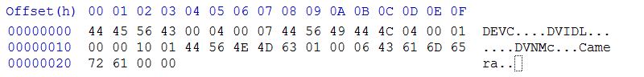

# GPMF Introduction

The GPMF structured storage format was originally proposed to store high-frequency periodic sensor data within a video file like an MP4. Action cameras, like that from GoPro, have limited computing resources beyond that needed to store video and audio, so any telemetry storage needed to be lightweight in computation, memory usage and storage bandwidth. While JSON and XML systems where initially considered, the burden on the embedded camera system was too great, so something simpler was needed. While the proposed GPMF structure could be used stand-alone, our intended implementation uses an additional time-indexed track with an MP4, and with an application marker within JPEG images. GPMF share a Key, Length, Value structure (KLV), similar to QuickTime atoms or Interchange File Format (IFF), but the new KLV system is better for describing sensor data. Problems solved:

* The contents of new Keys can be parsed without prior knowledge.
* Nested structures can be defined without &#39;Key&#39; dictionary.
* Structure prevents naming collisions between multiple sources.
* Nested structures allows for the communication of metadata for telemetry, such as scale, units, and data ranges etc.
* Somewhat human (engineer) readable (i.e. hex-editor friendly.)
* Timing and indexing for use existing methods stored within the wrapping MP4 of similar container format.

GPMF -- GoPro Metadata Format or General Purpose Metadata Format -- is a modified Key, Length, Value solution, with a 32-bit aligned payload, that is both compact, full extensible and somewhat human readable in a hex editor. GPMF allows for dependent creation of new FourCC tags, without requiring central registration to define the contents and whether the data is in a nested structure. GPMF is optimized as a time of capture storage format for the collection of sensor data as it happens. 

# GPMF-parser

## Included Within This Repository

* The complete source to an GPMF parser library
* Demo code for using the GPMF parser with extraction of GPMF from MP4 or MOV files.
* CMake support for building the demo project.
* Tested on:
  - macOS High Sierra with XCode v8 & v9
  - Windows 10 with Visual Studio 2015 & 2017
  - Ubuntu 16.04 with gcc v5.4

## License Terms

GPMF-parser is licensed under either:

* Apache License, Version 2.0, (LICENSE-APACHE or http://www.apache.org/licenses/LICENSE-2.0)
* MIT license (LICENSE-MIT or http://opensource.org/licenses/MIT)

at your option.

## Contribution

Unless you explicitly state otherwise, any contribution intentionally submitted for inclusion in the work by you, as defined in the Apache-2.0 license, shall be dual licensed as above, without any additional terms or conditions.

## GPMF Writing

A new open source repository has been created for the purpose (GPMF-Write https://github.com/gopro/gpmf-write)

## Quick Start for Developers

### Setup

Clone the project from Github (git clone https://github.com/gopro/gpmf-parser).

### Sample Code

GPMF-parser.c and .h provide a payload decoder for any raw stream stored in compliant GPMF. Extraction of the RAW GPMF from a video or image file is not covered by this tool.

```
#include <GPMF-parser.h>
GPMF_stream gs_stream;
if(GPMF_OK == GPMF_Init(&gs_stream, buffer_with_GPMF_data, size_of_the_buffer))
{
	do
	{
		switch(GPMF_Key(&gs_stream))
		{
		case STR2FOURCC(“ACCL”):
		  // Found accelerometer
		  samples = GPMF_Repeat(&gs_stream);
		  if(GPMF_OK == GPMF_ScaledData(&gs, temp_buffer, temp_buffersize, 0, samples, GPMF_TYPE_FLOAT)) 
		    {  /* Process scaled values */ }
		  break;
	  
		case STR2FOURCC(“cust”): 
		  // Found my custom data
		  samples = GPMF_Repeat(&gs_stream);
		  if(GPMF_OK == GPMF_FormattedData(&gs, temp_buffer, temp_buffersize, 0, samples)) 
		    { /* Process raw formatted data -- unscaled */ }
		  break;
	  
		default: // if you don’t know the Key you can skip to the next
		  break;
	}
} while (GPMF_OK == GPMF_Next(&gs_stream, GPMF_RECURSE_LEVELS)); // Scan through all GPMF data
```

If you only want particular a piece of data

```
#include <GPMF-parser.h>
GPMF_stream gs_stream;
if(GPMF_OK == GPMF_Init(&gs_stream, buffer_with_GPMF_data, size_of_the_buffer))
{
  if(GPMF_OK == GPMF_FindNext(&gs_stream, STR2FOURCC("ACCL"), GPMF_RECURSE_LEVELS))) 
   {
   	uint32_t key = GPMF_Key(&gs_stream);
   	char type = GPMF_Type(&gs_stream);
   	uint32_t samples = GPMF_Repeat(&gs_stream);
   	void *data = GPMF_RawData(&gs_stream);
	
	/* do your own byte-swapping and handling */	
   }
}
```

# GMFP Deeper Dive

## Definitions

| **Word** | **Definition** |
| --- | --- |
| Track | An MP4 container element used for storing video, audio or sub-titling over time |
| FourCC | The four character Key that marks a segment of data |
| Key | FourCC is the first element in Key-Length-Value 3-tuple |
| Length | This field describes the data that follows, including basic type, structural hints, sample counts |
| Value | Raw data to be stored in Big Endian |
| Device | Metadata sources below to devices, a camera my device and a connected BlueTooth sensor would be a separate device |
| Stream | Each metadata Device can have multiple streams on sensor data, e.g. Camera Device could have GPS, Accelerometer and Gyro streams |

### KLV Design

All data is Big Endian.



### FourCC

7-bit ASCII Key created for readability. All uppercase fourCCs are reserved Keys, mixed case is for any third party ingested data.

A few Keys reserved for communicating structure, although only DEVC is required at the beginning of any GPMF payload.

| **FourCC** | **Definition** | **Comment** |
| --- | --- | --- |
| DEVC | unique device source for metadata | Each connected device starts with DEVC. A GoPro camera or Karma drone would have their own DEVC for nested metadata to follow. |
| DVID | device/track ID | Auto generated unique-ID for managing a large number of connect devices, camera, karma and external BLE devices |
| DVNM | device name | Display name of the device like &quot;Karma 1.0&quot;, this is for communicating to the user the data recorded, so it should be informative. |
| STRM | Nested signal stream of metadata/telemetry | Metadata streams are each nested with STRM |
| STNM | Stream name | Display name for a stream like &quot;GPS RAW&quot;, this is for communicating to the user the data recorded, so it should be informative. |
| RMRK | Comments for any stream | Add more human readable information about the stream |
| SCAL | Scaling factor (divisor) | Sensor data often needs to be scaled to be presented with the correct units. SCAL is a divisor. |
| SIUN | Standard Units (like SI) | If the data can be formatted in GPMF&#39;s standard units, this is best. E.g. acceleration as &quot;m/s²&quot;.  SIUN allows for simple format conversions. |
| UNIT | Display units | While SIUN is preferred, not everything communicates well via standard units. E.g. engine speed as &quot;RPM&quot; is more user friendly than &quot;rad/s&quot;. |
| TYPE | Typedefs for complex structures | Not everything has a simple repeating type. For complex structure TYPE is used to describe the data packed within each sample. |
| TSMP | Total Samples delivered | Internal field that counts all the sample delivered since record start, and is automatically computed. |
| EMPT | Empty payload count | Internal field that reports the number of payloads that contain no new data. TSMP and EMPT simplify the extraction of clock. |

### Length (type-size-repeat structure)

The tradition 32-bit &quot;Length&quot; is broken up to help describe the data that follows.

#### Structure Size

8-bits is used for a sample size, each sample is limited to 255 bytes or less.

#### Repeat

16-bits is used to indicate the number of samples in a GPMF payload, this is the Repeat field. Struct Size and the Repeat allow for up to 16.7MB of data in a single KLV GPMF payload.

#### Type

The final 8-bits, Type, is used to describe the data format within the sample. Just as FOURCC Keys are human readable, the TYPE is using a ASCII character to describe the data stored. A character &#39;f&#39; would describe float data, &#39;d&#39; for double precision, etc. All types are reserved, and are not end user definable.

Current types:

| **Type Char** | **Definition** | **typedef** | **Comment** |
| --- | --- | --- | --- |
| **b** | single byte signed integer | int8\_t | -128 to 127 |
| **B** | single byte unsigned integer | uint8\_t | 0 to 255 |
| **c** | single byte &#39;c&#39; style ASCII character string | char | Optionally NULL terminated - size/repeat sets the length |
| **s** | 16-bit signed integer | int16\_t | -32768 to 32768 |
| **S** | 16-bit unsigned integer | uint16\_t | 0 to 65536 |
| **l** | 32-bit signed integer | int32\_t |   |
| **L** | 32-bit unsigned integer | uint32\_t |   |
| **f** | 32-bit float (IEEE 754) | float |   |
| **d** | 64-bit double precision (IEEE 754) | double |   |
| **F** | 32-bit four character key -- FourCC | char fourcc\[4\] |   |
| **G** | 128-bit ID (like UUID) | uint8\_t guid\[16\] |   |
| **j** | 64-bit signed unsigned number | int64\_t |   |
| **J** | 64-bit unsigned unsigned number | uint64\_t |   |
| **q** | 32-bit Q Number Q15.16 | uint32\_t | 16-bit integer (A) with 16-bit fixed point (B) for A.B value (range -32768.0 to 32767.99998) |
| **Q** | 64-bit Q Number Q31.32 | uint64\_t | 32-bit integer (A) with 32-bit fixed point (B) for A.B value. |
| **U** | UTC Date and Time string | char utcdate\[16\] | Date + UTC Time format yymmddhhmmss.sss - (years 20xx covered) |
| **?** | data structure is complex | TYPE | Structure is defined with a preceding TYPE |
| **null** | Nested metadata | uint32\_t | The data within is GPMF structured KLV data |

## Alignment and Storage

All GPMF data is 32-bit aligned and stored as big-endian. For data types that are not 32-bit, they are packed in their native byte or short or complex structure storage size, and only padded at the very end to meet GPMF KLV alignment needs.  Storage of a single 1 byte, would have 3-pad bytes.

DEMO,  &#39;b&#39; 1  1,  &lt;byte value&gt; 0 0 0



The same data type stored 15 times would have only a only byte pad at the end.

DEMO,  &#39;b&#39; 1  15,  &lt;15 bytes data&gt; 0



Packed data will all maintain a 32-bit alignment between GPMF KLV 3-tuples.

DMO1, b  1 1, &lt;byte value&gt; 0 0 0 DMO2 b 1 15 &lt;values&gt; 0 DMO3 L 4 1 &lt;32-bit values&gt;



While padding is shown as null values, any value can be used, as this data is simply ignored.

The packed data size with in a GPMF KLV is the structure size times the number of samples. The storage size is rounded up to the next 32-bit aligned size.

## Multiple axis sensor data

As sensor data like gyro and accelerometer commonly have three (or more) axes of the same data type, the combination of Type and Structure Size, will indicate the type of data within. Three axis GYRO data could have a Type of &#39;s&#39; (short 16-bit signed integer) with a Structure size of 6. As the size of the Type is known, the number of axes in each sample is Structure size / sizeof (Type). An examples of 6 samples of a 6 byte x,y,z structure GYRO data is shown here:



## GPMF Nesting

Standalone GPMF does little for communicating the relationship between data, so that we need to nest so that metadata can describe other data. Type of null is the flag that indicates the data field is any other GPMF KLV series. We use nesting to describe any telemetry device like follows:

```
DEVC null 4 7
   DVID L 4 1 0x1001
   DVNM c 1 6 Camera
 ```

This is a valid nested GPMF structure. DEVC describe 4\*7 = 28 bytes of data, which are packed and aligned GPMF KLV values describing a camera device with a Device ID and a Device Name.



### Property Hierarchy

Metadata, data that applies to other data, is forward looking within each nested GPMF entry. In the previous example the Device ID is applied to the Device Name, as they&#39;re part of the same nest and Device ID came before Device Name. This order of properties is particularly import when KLV 3-tuples modifies the meaning of data to follow in the same nest level, which is how SCAL and TYPE are applied. Several modify properties can be transmitted, each adding metadata to modify the meaning of the **last** KLV in the nest (at this nest level.) The SCAL key is used as sensors that measure physical properties typically output integers that must be scaled to produce a real-world value. This scaling converting raw data to float or Q-numbers (fixed point float) could be performed in the device, but is often stored more efficiently as the original sensor values and a scale property. These are equivalent:

```
STRM null <size><repeat>
   ACCL 'f' 12 100  <100 samples of x,y,z accelerometer data as 32-bit floats>
```
 
```
STRM null <size><repeat>
   SCAL 's' 2 1 scale   
   ACCL 's' 6 100 <100 samples of x,y,z accelerometer data as 16-bit shorts>
```

The second data stream is almost half the size of the first (1216 vs 628 bytes) for the same resulting precision.

When adding units, the SCAL doesn&#39;t apply to SUIN, but only the ACCL the latest KLV in the stream&#39;s (STRM) nest.

```
STRM null <size><repeat> 
   SCAL 's' 2 1 scale   
   SIUN 'c' 4 1 "m/s²"   
   ACCL 's' 6 100 <100 samples of x,y,z accelerometer data as 16-bit shorts>
```

Note: The SI unit of &quot;m/s²&quot; is applied to each x,y,z axis, there is no need to declare the unit as

```
SIUN 'c' 4 3 "m/s²","m/s²","m/s²"
```

A complete stream from a device could be:

```
STRM null <size><repeat>
   TSMP 'L' 4 1  196   
   STNM 'c' 50 1  "Accelerometer (up/down, right/left, forward/back)"   
   TMPC 'f' 4 1  56.0723   
   SIUN 'c' 4 1  "m/s²"   
   SCAL 's' 2 1  418   
   ACCL 's' 6 100  4418, -628, -571, ...
```

Including a stream name to improve readability and TMPC for the temperature of the device that is collecting the accelerometer data.

## Multi-sample and Non-periodic data.

Virtual sensors, CV or computationally extracted metadata will become a common storage type. The data form this new sources could produce multiple samples for a given time (5 faces in this frame) and the results may be delayed in delivering their findings (frame 1000 has 7 faces, yet is was reported on frame 1003.) Both the potential for delay timing and multiple samples requires custom storage.

In the example below is for a fast, periodic (once per frame), face detection algorithm (no delays):

```
STRM null <size><repeat> 
 TSMP 'L' 4 1 196 
 STNM 'c' 50 1 "Face bounding boxes (age, gender, x1,y1,x2,y2)" 
 TYPE 'c' 1 6  "SSffff", 
 FACE '?' 20 3 <face1, face2, face3> 
 FACE '?' 20 4 <face1, face2, face3, face4> 
 FACE '?' 20 0  
 FACE '?' 20 2 <face1, face2> 
 ...
```

The timing information is extracted just like all other sensor, yet the multiple entries of &quot;FACE&quot; vertically represent samples over time, and &quot;faceX&quot; are multiple samples at the same time. When no FACE are discovered, &quot;FACE ? 20 0&quot; is used to preserve the timing, just as GYRO report zeros when then camera is stationary.

If the data where to occur with a significantly slower algorithm that is not periodic, say the first detection took 300ms, the second 400ms,, the third 100ms, the last 250ms, the timing relationship to the source frame would be lost.  While most of GPMF data can rely of the timing provided by MP4 indexing, to handling delayed and aperiodic data introduces TICK and TOCK to make the in and out times (in time is the beginning of the processing, out-time the end.

```
DEVC null <size0><repeat0> 
 DVID 'L' 4 1 1001
 DVNM 'c' 6 1 "Camera" 
 TICK 'L' 4 1 10140 
 STRM null <size><repeat>  
   TSMP 'L' 4 1 196   
   STNM 'c' 50 1 "Face bounding boxes (x1,y1,x2,y2,age,gender,flags,confidence)"   
   TYPE 'c' 1  6 "ffffBBBB",   
   FACE null <size1><repeat1>
     TICK 'L' 4 1 10023     
     TOCK 'L' 4 1 10320     
     FACE '?' 20 3 <face1, face2, face3>     
   FACE null <size2><repeat2>   
     TICK 'L' 4 1 10347     
     TOCK 'L' 4 1 10751     
     FACE '?' 20 3 <face1, face2, face3, face4>     
   FACE null <size3><repeat3>   
     TICK 'L' 4 1 10347     
     TOCK 'L' 4 1 10751     
     FACE '?' 20 0     
   FACE null <size4><repeat4>   
    TICK 'L' 4 1 10347    
    TOCK 'L' 4 1 11005    
    FACE '?' 20 3 <face1, face2>   
```

As the CV processing in this example can take time, it will be common for the processing to begin before the payload frame it which it is written. The first FACE samples begin their processing at 10023, yet the payload for normal sample data began at 10140 (within the top DEVC structure).

## Standard Units for physical properties supported by SUIN

### Base Units

| length | meter | m | SI Unit |
| --- | --- | --- | --- |
| mass | gram       | g | SI Unit |
| time | second | s | SI Unit |
| electric current | ampere | A | SI Unit |
| temperature       | kelvin | K | SI Unit |
| luminous intensity | candela | cd | SI Unit |
| magnetic flux density | tesla | T | non-SI |
| angle | radian | rad | non-SI |
| temperature | Celsius | °C | non-SI |
| frequency | hertz | Hz | non-SI |
| memory | Byte | B | non-SI |

### Modifiers supported

| p (pico) | 10x-12 |
| --- | --- |
| n (nano) | 10x^9 |
| µ (micro) | 10x^6 |
| m (milli) | 10x^3 |
| k (kilo) | 10^3 (1000) |
| M (mega) | 10^6 (1,000,000) |
| G (giga) | 10^9 (1,000,000,000) |
| T (tera) | 10^12 |

##### Common Properties in SIUN

| speed, velocity | meter per second | m/s |
| --- | --- | --- |
| acceleration | meter per second squared | m/s² |
| luminance | candela per square meter | cd/m² |
| gyro | radians per second | rad/s |
| Compass readings | milli Tesla or micro Tesla | mT or µT |
| distance | kilometers, millimeter, etc. | km or mm or ... |
| memory used/free | MegaByte, GigaByte, etc. | kB, MB, GB ... |
| frequency | KiloHertz, GigaHertz, etc. | kHz, GHz, ... |

##### Special ASCII Characters

As the SIUN is declared as an ASCII the character for degrees, squared, cubed and micro use the single byte values: 0xB0 (°), 0xB2 (²), 0xB3 (³) and 0xB5 (µ).

**Complex structures**

Not all telemetry data can be described as an array of a single basic type. To support complex structures, a TYPE field is added to the property hierarchy. TYPE is always defined with &#39;c&#39; and used the same ASCII Type Chars to describe a complex structure. Examples structure:

```
typedef struct
{
   float field_strength;
   short x_offset, y_offset;
   unsigned long status_flags;
} myDeviceData; //myDD
```

The TYPE for the structure be a &#39;f&#39;,&#39;s&#39;,&#39;s&#39;,&#39;L&#39; (float, short, short, unsigned long) is declared as follows:

```
STRM null <size><repeat> 
   TYPE 'c' 1 4 "fssL"
   myDD '?' 12 <repeat> <n samples of myDeviceData>
```

The &#39;?&#39; for the type field in &#39;myDD&#39; is used to indicate a complex structure type.

As this will likely have units that differ per parameter, we need to send units for each element of the complex structure

```
   TYPE 'c' 1 4 "fssL"
   SIUN 'c' 2 4 "µTmmmm " // for units µT mm mm and NONE
   myDD '?' 12 <repeat> <n samples of myDeviceData>
```

The same for scale, each unit will likely have a different scale. If no scale is required use 1, likely the flags field will not be scaled.

```
   TYPE 'c' 1 4 "fssL"
   SIUN 'c' 3 4 "µT mm mm " // for units µT mm mm and NONE, here padded for readability (optional)
   SCAL 's' 2 4 1000000, 1000, 1000, 1
   myDD '?' 12 <repeat> <n samples of myDeviceData>
```

Arrays can be defined within the string TYPE as follows:

```
typedef struct
{
   float farray[8];
   unsigned long flags;
} myDeviceData; //myDD
```

The use of &#39;[n]&#39; indicates the field is repeated n times. So an array of eight floats as described with &quot;f[8]&quot;

```
TYPE 'c' 1 5 "f[8]L"
  myDD '?' 36 <repeat> <n samples of myDeviceData>
```

## Sticky Metadata

The metadata writing API should have a mechanism for creating and writing &quot;sticky&quot; metadata. Data of type sticky doesn&#39;t need to be re-transmitted if it is not changing, and it will only store the last value it is does change.  Sticky data is good for slow changing properties like the sensor&#39;s temperature, or any data that is sampled near the payload frequency or slower. Any metadata the modifies the meaning of sensor data should be written as sticky data: all TYPEs, SUINs, SCALs, naming fields (DVNM, STNM) and comments that are not changing over time.  This data needs to be within each payload in the event that the file is cut in to smaller segments, each segment must contain all relevant metadata so that no meaning is lost in the extracted clip.

## Style Guide

The addition of structure is not to make device vendor&#39;s life more difficult, but to communicate the meaning of data to a future reader, that may not even be aware of the device used in the original capture. The first useful metadata is a human readable name of the device. While DVNM (DeviceName) &quot;Camera&quot; is in the current metadata, saying &quot;GoPro Hero5 Black&quot; would be much better. Having a stream (STRM) with ACCL data, doesn&#39;t communicate what it contains, when adding a STNM or RMRK with &quot;Accelerometer (up/down, right/left, forward/back)&quot; adds a lot of clarity to the future data reader. SUIN, UNIT, SCAL and even TYPE is completely optional if you don&#39;t intend anyone other than for your own tools to process this data, but it is so much better to allow many tools to extract and process all data. Use of a standard unit (SIUN) allows downstream tools to convert accurately from m/s to MPH or kmH etc. under the end users control.

## MP4 Implementation

GPMF data is stored much like every other media track within the MP4, where the indexing and offsets are presented in the MP4 structure, not the data payload. GPMF storage is most similar to PCM audio, as it contains RAW uncompressed sensor data, however the sample rate for the track is for the GPMF payload, not the data within. GPMF might be stored at 1Hz (stored in the track description), but contain gyro data at 400Hz, accelerometer at 200Hz and GPS at 18Hz (HERO5 launch data-rates).

### GoPro&#39;s MP4 Structure

Telemetry carrying MP4 files will have a minimum of four tracks: Video, audio, timecode and telemetry (GPMF). A fifth track (&#39;SOS&#39;) is used in file recovery in HERO4 and HERO5, can be ignored.

File structure:
```
  ftyp [type ‘mp41’]
  mdat [all the data for all tracks are interleaved]
  moov [all the header/index info]
    ‘trak’ subtype ‘vide’, name “GoPro AVC”, H.264 video data 
    ‘trak’ subtype ‘soun’, name “GoPro AAC”, to AAC audio data
    ‘trak’ subtype ‘tmcd’, name “GoPro TCD”, starting timecode (time of day as frame since midnight)
    ‘trak’ subtype ‘meta’, name “GoPro MET”, GPMF telemetry
 ```
 
#### Inside the 'meta' Track

Just as video and audio tracks can have different formats within, the 'meta' track is not exclusive for GPMF. While the use of 'meta' in MP4 files is very likely a GoPro camera, it is not always GPMF data.  For a number of years GoPro cameras had a 'meta' track used for a file repair containing 'fdsc' data, this is also called the SOS track. To confirm you have a GPMF style track, scan for the sample description atom which uses the type '**gpmd**' for GPMF data. The entire MP4 metadata track is typically structured like this:

```
  'trak'
     'tkhd' < track header data >
     'mdia' 
        'mdhd' < media header data >
        'hdlr' < ... Component type = 'mhlr', Component subtype = 'meta', ... Component name = “GoPro MET” ... >
	'minf' 
	   'gmhd' 
	      'gmin' < media info data >
	      'gpmd' < the type for GPMF data >
	   'dinf' < data information >
	   'stbl' < sample table within >
	      'stsd' < sample description with data format 'gpmd', the type used for GPMF >
	      'stts' < GPMF sample duration for each payload >
	      'stsz' < GPMF byte size for each payload >
	      'stco' < GPMF byte offset with the MP4 for each payload >
```

for more details on MP4 structure 'stts', 'stsz' and 'stco' see  https://developer.apple.com/library/content/documentation/QuickTime/QTFF/QTFFChap2/qtff2.html#//apple_ref/doc/uid/TP40000939-CH204-61112

## GPMF Timing and Clocks

Timing and sample rates are not directly expressed within GPMF and for good reasons. When you set a device up with a sample frequency of say 200Hz, or 48kHz for audio, you would think that number should be presented in the header. Adding timing to the header is good if the different channels of data share a single reference clock. A video file can accurately state it is 25.0Hz with 48kHz audio, if the video and audio are clocked together from the same crystal or timing source. However, two separate cameras will have slightly different timing, differing up to the tolerances of the clock source. A crystal may have timing with stated accuracy of 50 ppm (parts per million), which would have audio of one camera between 47,997 to 48,003Hz when compared with the other. This potential ±0.005% error is minor compared with the accuracy for the average independently clocked sensor. Camera internal sensors or data via a connected Bluetooth device, will have timing errors in the range ±1%.  There is no value to storing timing metadata that will be significantly wrong in most cases. The timing and the clock extraction for GPMF is determined after capture. The amount of data stored in GPMF is compared with tracks that do have timing, like the master clock with an MP4. 

An example video clip has these measured sample rates:

Four | Data | Set Frequency | Measured Frequency
----- | ------ | ------ | --------
SHUT | shutter exposure times | 23.976 Hz | 23.976 Hz
ACCL | IMU data accelerometer | 200 Hz | 201.923 Hz
GYRO | IMU data gyroscope | 400 Hz |  403.846 Hz 
GPS5 | GPS Location | 18Hz | 18.169 Hz

To speed the measurement of any stream of data, the more recent bitstreams have a Key of TSMP (Total Samples) the counts the ongoing number of samples for each stream – so you don’t have to count them manually. If you compare the TSMP of the first payload with the last, you can easily determine the number of samples, then compare with the time of the video track (or MP4 clock timing), establishing the average sample rate for the GPMF data. This is not including compensation for thermal clock drifts, which do occur, although for most applications they are small enough to be safely ignored. Some streams include device temperature (GPMF Key is TMPC) for thermal clock drift or temperature sensitive calibrations.

### Sample Jitter

As clocks can’t be trusted, what else can go wrong? The storage of GPMF data is typically a software system, like the embedded RTOS (Real-time OS) of a GoPro camera, it will have its own timing issues. Any OS is another source of an unreliable clock, as it introduces timing jitter due to process switching time, and interrupt response times inherent in all OSes. A device driver for a sensor may send a group of samples, to a thread that formats and stores GPMF, that is combined with other GPMF sensors, at any time the accumulated sample data can be flushed and time-stamped within the MP4. A 200Hz device, flushed at one second intervals, could have payload sample counts of 199, 202, 201, 198, 199, etc.  Again the TSMP in every GPMF payload simplifies extraction timing for every sample stored, even with clock drift and sampling jitter. Sample code demos this.

## Where to find GPMF data
 
GoPro HERO5, HERO6 and Fusion cameras have a GPMF track. HERO4 Black will have GPMF flight telemetry when attach to the GoPro Karma drone. All GoPro HERO4 onwards can have third party BlueTooth sensor adding GPMF data.

### HERO5 Black and Session 

| FourCC | Property | approximate frequency (Hz) | SIUN or UNIT | Comment |
| --- | --- | --- | --- | --- |
| ACCL | 3-axis accelerometer | 200 | m/s² |   |
| GYRO | 3-axis gyroscope | 400 | rad/s |   |
| ISOG | Image sensor gain | 24, 25 or 30 (based video frame rate) | n/a | HERO5 v2 or greater firmware |   
| SHUT | Exposure time | 24, 25 or 30 (based video frame rate) | s | HERO5 v2 or greater firmware |  

### Hero5 Black with GPS Enabled Adds

| FourCC | Property | approximate frequency (Hz) | SIUN or UNIT | Comment |
| --- | --- | --- | --- | --- |
| GPS5 | latitude, longitude, altitude (WGS 84), 2D ground speed, and 3D speed | 18 | deg, deg, m, m/s, m/s |  |  
| GPSU | UTC time and data from GPS | 1 | n/a | Within the GPS stream |  
| GPSF | GPS Fix | 1 | n/a | Within the GPS stream: 0 - no lock, 2 or 3 - 2D or 3D Lock |  
| GPSP | GPS Precision - Dilution of Precision (DOP x100) | 1 | n/a | Within the GPS stream, under 500 is good |  

For more information of GPSP (or DOP) see https://en.wikipedia.org/wiki/Dilution_of_precision_(navigation)

### Fusion Adds and Changes

| FourCC | Property | approximate frequency (Hz) | SIUN or UNIT | Comment |
| --- | --- | --- | --- | --- |
| GYRO | 3-axis gyroscope | 3200 | rad/s | Increased precision for post stablization |
| STMP | microsecond timestampes | 1 | µs | Increased precision for post stablization |
| MAGN | magnetometer  | 24 | µT | Camera pointing direction |
| ISOG | Image sensor gain | increased to 60 | n/a | per frame exposure metadata |   
| SHUT | Exposure time | increased to 60 | s | per frame exposure metadata |  

### Hero6 Black Adds and Changes, Otherwise Supports All HERO5 metadata

| FourCC | Property | approximate frequency (Hz) | SIUN or UNIT | Comment |
| --- | --- | --- | --- | --- |
| GYRO | 3-axis gyroscope | 200 | rad/s | Reduce speed gyroscope from HERO5 |
| FACE | Face detection boundaring boxes | 12, 12.5 or 15 (based video frame rate) | n/a | struct ID,x,y,w,h -- not supported in HEVC modes |
| FCNM | Faces counted per frame| 12, 12.5 or 15 (based video frame rate) | n/a | Not supported in HEVC modes |
| ISOE | Sensor ISO | 24, 25 or 30 (based video frame rate) | n/a | replaces ISOG, has the same function |   
| ALLD | Auto Low Light frame Duration | 24, 25 or 30 (based video frame rate) | n/a | ALL extended exposure time |
| WBAL | White Balance in Kelvin |  24, 25 or 30 (based video frame rate) | n/a | Classic white balance info |
| WRGB | White Balance RGB gains |  24, 25 or 30 (based video frame rate) | n/a | Geeky white balance info |


```
GoPro is trademark of GoPro, Inc.
```

